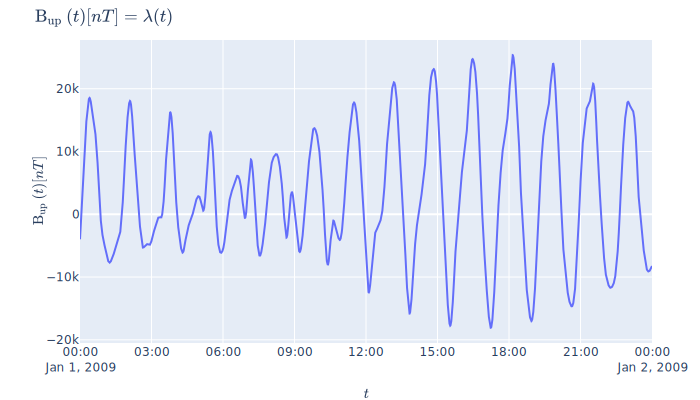

---
jupyter:
  jupytext:
    text_representation:
      extension: .md
      format_name: markdown
      format_version: '1.3'
      jupytext_version: 1.13.0
  kernelspec:
    display_name: Python 3 (ipykernel)
    language: python
    name: python3
---

# Tutorial

```python
from pysat_kamodo import Pysat_Kamodo
import pysat
```

!!! note
    pysat will notify you if it needs to set up default directories for the initial import


## Instrument Initialization

To initialize a pysat instrument, we require that a date be specified along with the usual pysat keyword arguments:

!!! note
    this example requires [pysatNASA](https://github.com/pysat/pysatNASA)

```python
import pandas as pd

pki = Pysat_Kamodo('2009, 1, 1', # Pysat_Kamodo allows string dates
                  platform = 'cnofs', # pysat keyword
                  name='vefi', # pysat keyword
                  tag='dc_b',# pysat keyword
                  )
pki
```

The above Kamodo instance shows all available variables from the pysat `cnofs vefi` instrument together with units. The left-hand side of these equations represents the variables loaded by pysat. The right-hand side $\lambda(t)$ expressions mean that there is some time interpolator defined for these variables that is not in closed form. More information for each variable, including the instrument's citation info, can be read from the variable docs:

```python
help(pki.B_flag)
```

## Interpolation
These "Kamodofied" variables support automatic time interpolation. First let's specify a few arbitrary moments in time.

```python
t1 = pd.datetime(2009, 1, 1, 3, 39, 45)
t2 = pd.datetime(2009, 1, 1, 3, 42, 33)
t3 = pd.datetime(2009, 1, 1, 3, 51, 10)
times = [t1, t2, t3]
```

To interpolate a given variable at these times, simply call the variable like you would a function:

```python
pki.B_up(times)
```

Our Kamodo object uses the native instrument time as a default parameter. This means we can easily retrieve the original raw data by not specifying a time:

```python
# head pandas method just shows the first 5 results
pki.B_up().head()
```

## Visualization


Kamodo uses plotly for visualization and easy web deployment. The default time allows Kamodo to determine an appropriate range for these quick-look graphics. 

```python
import plotly.io as pio
fig = pki.plot('B_up')
pio.write_image(fig, 'figure1.svg')
```




## Interactive plotting

To plot interacvtively in the notebook use plotly's `iplot` and `plot` tools.

```python
from plotly.offline import init_notebook_mode, plot, iplot
init_notebook_mode(connected = True)

# renders in notebook cell
iplot(fig)

# saves to html and opens in new browser tab
plot(fig)
```

!!! note
    Writing image to file requires plotly-orca (`conda install -c plotly plotly-orca`) and psutil (`pip install psutil`)


## PyHC standards

`Pysat_Kamodo` objects have `data` and `meta` attributes, in keeping with the Python-in-Heliophysics Community standards. These are not to be confused with pysat's `data` and `meta` attributes, which are stored in `Pysat_Kamodo._instrument.meta` and `Pysat_Kamodo._instrument.data`, respectively.


## Pysat_Kamodo `meta` attributes


The `meta` attribute illustrates Kamodo's minimalistic view of the world: under the hood, Kamodo uses the symbolic programing library [Sympy](https://docs.sympy.org/0.7.0/tutorial.html#introduction), so it only needs to keep track of symbols and units.

```python
pki.meta
```

Kamodo also has some book-keeping metadata tied to indvidual variables:

```python
pki.B_flag.meta
```

## Pysat_Kamodo `data` attributes


The high-level data attribute provides a dictionary-access to the underlying instrument data. Custom function data is also available here.

```python
pki.data['B_north'].head()
```

The instrument data is also available at the variable level:

```python
pki.B_north.data.head()
```

In this case, these are the same as the instrument data. However, Kamodo variables can come from any Kamodo-compatible function or data source, not just pysat data. See Kamodo's documentation on [Kamodofication](https://ccmc.gsfc.nasa.gov/Kamodo/notebooks/Kamodo/#kamodofication) and the turorial on [Kamodofying Models](https://nbviewer.jupyter.org/github/asherp/Kamodo/blob/master/docs/notebooks/Kamodofying_Models.ipynb) for examples.
